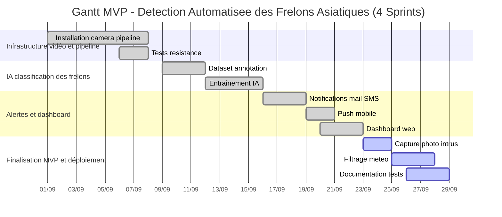

# Projet SCRUM - Détection d’attaques de frelons  

# Sommaire
- [Projet SCRUM - Détection d’attaques de frelons](#projet-scrum---détection-dattaques-de-frelons)
- [Sommaire](#sommaire)
- [1. Contexte](#1-contexte)
  - [Organisation Scrum : rôles et missions](#organisation-scrum--rôles-et-missions)
- [2. Product Backlog détaillé](#2-product-backlog-détaillé)
- [3. Planning Meeting](#3-planning-meeting)
  - [Objectifs du Planning Meeting](#objectifs-du-planning-meeting)
  - [Découpage en Sprints](#découpage-en-sprints)
  - [Rituels Scrum planifiés](#rituels-scrum-planifiés)
  - [Outils de suivi retenus](#outils-de-suivi-retenus)
  - [Questions clés et réponses anticipées](#questions-clés-et-réponses-anticipées)
  - [Prochaines étapes](#prochaines-étapes)
- [4. Sprints Planning](#4-sprints-planning)
  - [Sprint 1 : Infrastructure vidéo et pipeline](#sprint-1--infrastructure-vidéo-et-pipeline)
  - [Sprint 2 : IA de détection et classification](#sprint-2--ia-de-détection-et-classification)
  - [Sprint 3 : Alertes et dashboard](#sprint-3--alertes-et-dashboard)
  - [Sprint 4 : Finalisation MVP et déploiement](#sprint-4--finalisation-mvp-et-déploiement)
- [5. Sprint Review - Fin du cycle de 4 semaines](#5-sprint-review---fin-du-cycle-de-4-semaines)
- [6. Sprint Retrospective - Fin du cycle de 4 semaines](#6-sprint-retrospective---fin-du-cycle-de-4-semaines)
- [7. Sprint Review Hebdomadaire (Exemple pour Sprint 2 : IA de classification)](#7-sprint-review-hebdomadaire-exemple-pour-sprint-2--ia-de-classification)
- [8. FAQ et Points sensibles à discuter](#8-faq-et-points-sensibles-à-discuter)
    - [Gestion des risques](#gestion-des-risques)
    - [Communication d’équipe](#communication-déquipe)
 

# 1. Contexte  

Le projet vise à développer un système innovant de détection automatique des attaques de frelons asiatiques et européens sur des ruches d’abeilles. Ce système doit permettre aux apiculteurs de recevoir des alertes en temps réel et de consulter des statistiques précises pour mieux protéger leurs colonies. Le développement s’inscrit dans une démarche agile Scrum pour une livraison rapide et incrémentale de valeur métier.

## Organisation Scrum : rôles et missions  

- **Product Owner (PO) : Olivier**  
  Responsable de la vision produit et de la priorisation du backlog. Il s’assure que les besoins métier sont bien compris et traduits en User Stories claires, valide les livrables à chaque sprint et pilote la relation avec les parties prenantes.

- **Scrum Master : Romuald**  
  Facilitateur du processus Scrum, il organise les rituels, aide l’équipe à lever les obstacles, veille au respect des bonnes pratiques Scrum et à l’amélioration continue du fonctionnement de l’équipe.

- **Équipe de développement : Kahina (et autres membres)**  
  Responsable de la réalisation technique, elle conçoit, développe, teste et intègre les fonctionnalités. L’équipe est auto-organisée et collabore étroitement avec le PO pour livrer les User Stories définies dans le sprint.

# 2. Product Backlog détaillé 

| Priorité | User Story | Critères d’acceptation clés | Definition of Done | Story Points | Timebox estimé |
|----------|------------|--------------|-----------------------------|--------------------|------------|
| 1        | US1 - Identification Frelon (Asiatique/Européen) | - Précision ≥85% sur jeu test                                 | - Modèle intégré dans pipeline et fonctionnel                    | 8            | 7 à 10 jours          |
|          |                                            | - Classification fiable des 2 types                          | - Validation PO réalisée                                         |              |                       |
|          |                                            |                                                              | - Code review effectué, tests automatisés réussis                |              |                       |
| 1        | US2 - Dashboard Statistiques Quotidiennes  | - Dashboard web responsive avec stats temps réel             | - Données actualisées en temps réel                              | 5            | 4 à 6 jours           |
|          |                                            | - Affichage nombre d’attaques, types frelons, heures         | - Tests fonctionnels complets                                    |              |                       |
|          |                                            |                                                              | - Documentation utilisateur mise à jour                          |              |                       |
| 1        | US3 - Alerte Immédiate (Mail/SMS)           | - Notifications envoyées < 5 min après détection             | - Notifications testées sur au moins 2 canaux                   | 5            | 4 à 6 jours           |
|          |                                            |                                                              | - Tests de latence validés                                       |              |                       |
| 1        | US4 - Alerte Immédiate (Push Mobile)         | - Notifications push fonctionnelles sur Android et iOS       | - Tests sur émulateurs ou appareils réels                       | 5            | 4 à 6 jours           |
|          |                                            | - Latence et fiabilité testées                                | - Documentation mise à jour                                      |              |                       |
| 1        | US5 - Capture Photo Intrus                   | - Photo prise dans les 2 sec après détection                  | - Qualité photo validée par l’équipe                             | 8            | 7 à 10 jours          |
|          |                                            | - Résolution suffisante pour identification humaine          | - Intégration fonctionnelle dans pipeline                        |              |                       |
| 2        | US6 - Filtrage météo (éviter faux positifs) | - Réduction d’au moins 50% des faux positifs météo           | - Tests en conditions réelles et simulées                        | 8            | 7 à 10 jours          |
|          |                                            |                                                              | - Algorithme validé et intégré                                   |              |                       |
| 2        | US7 - Gestion nuage d’abeilles / multiples ruches | - Distinction fiable entre nuage d’abeilles et attaque frelon | - Validation terrain ou simulation                               | 8            | 7 à 10 jours          |
|          |                                            | - Indication de présence de plusieurs ruches                 | - Documentation associée                                         |              |                       |
| 3        | US8 - Triangulation position du Nid          | - Estimation du nid à < 50m de précision sur tests terrain   | - Algorithme de triangulation intégré et testé                  | 13           | 10 à 15 jours         |
|          |                                            |                                                              | - Plans d’atténuation documentés                                |              |                       |
| 3        | US9 - Détection de plusieurs Nids             | - Détection d’au moins 2 nids distincts >80% précision       | - Tests validés en scénario multi-nids                          | 13           | 10 à 15 jours         |
|          |                                            |                                                              | - Rapports et documentation complète                             |              |                       |

Chaque User Story doit être affinée et détaillée dans Trello ou l’outil de gestion choisi, avec checklist, pièces jointes, commentaires et responsabilités assignées.  

---

# 3. Planning Meeting  

*Début du Planning Meeting*

**Date : 01/09/2025**  
**Participants : Olivier (PO), Romuald (Scrum Master), Kahina (Développeur)**

---

## Objectifs du Planning Meeting  
- Valider la vision globale du projet et ses objectifs métiers.  
- Découper le projet en Sprints clairs avec des objectifs précis.  
- Sélectionner les User Stories prioritaires pour chaque sprint.  
- Estimer la charge et définir la velocity prévisionnelle.  
- Organiser les rituels Scrum et outils de suivi.  

---

## Découpage en Sprints  

| Semaine   | Objectif Sprint                      | Stories sélectionnées          | Definition of Done / Critères clés                  |
|-----------|------------------------------------|-------------------------------|-----------------------------------------------------|
| Semaine 1 | Infrastructure vidéo et pipeline   | US1                           | Caméra robuste, flux vidéo stable, tests météo validés |
| Semaine 2 | IA classification des frelons      | US2                           | Modèle IA précision >85%, intégré et testé          |
| Semaine 3 | Alertes et dashboard               | US3, US4                      | Notifications fonctionnelles, dashboard accessible  |
| Semaine 4 | Finalisation MVP et déploiement   | US5, US6                      | Photo intrus, tests 72h, documentation livrée       |

---

## Rituels Scrum planifiés  
- **Sprint Planning:** lundi 9h-10h  
- **Daily Scrum:** 15 minutes chaque jour à 9h30  
- **Sprint Review:** dernier jour de chaque sprint  
- **Sprint Retrospective:** après la Sprint Review  

---

## Outils de suivi retenus  
- **Trello:** gestion des User Stories et tâches  
- **Burndown Chart:** suivi de la progression du sprint  
- **Velocity:** mesure de la performance sprint à sprint  

---

## Questions clés et réponses anticipées  
- *Disponibilité des experts entomologistes pour annotation ?* Planification en avance et sessions coordonnées.  
- *Risques liés aux conditions météo ?* Tests en simulation et tests en conditions réelles seront effectués.  
- *Priorisation des fonctionnalités secondaires ?* Elles seront intégrées dans les sprints ultérieurs après validation du MVP.  

---

## Prochaines étapes  
- Finaliser le backlog produit détaillé.  
- Préparer le Sprint Planning 1.  
- Valider les ressources et outils nécessaires.  

**Conclusion :**  
Ce Planning Meeting a permis d’aligner toute l’équipe et les parties prenantes sur la vision, les priorités et le découpage en sprints. Il instaure un cadre clair et collaboratif qui facilitera la livraison incrémentale de valeur métier tout au long du projet.  

*Fin du Planning Meeting*

---

# 4. Sprints Planning  

## Sprint 1 : Infrastructure vidéo et pipeline  

**Sprint Goal :**  
Installer un système de capture vidéo robuste et stable en toutes conditions météo avec un flux vidéo prêt pour traitement temps réel.  

**User Stories sélectionnées :**  
- US1 - Identification Frelon (Asiatique/Européen) [Préparation initiale d’infrastructure]  

**Tâches principales :**  
- Sélection et achat caméra IP66/67 résistante aux intempéries  
- Conception et installation du boîtier étanche avec chauffage anti-condensation  
- Mise en place du pipeline de streaming vidéo stable  
- Réalisation de tests de résistance aux intempéries (simulation pluie, neige)  

**Definition of Done :**  
- Caméra fonctionnelle 24h/24 en conditions réelles  
- Flux vidéo stable et continu  
- Tests météo validés avec rapport d’évaluation  

---

## Sprint 2 : IA de détection et classification  

**Sprint Goal :**  
Constituer un dataset annoté et entraîner un modèle IA capable de différencier frelons asiatiques, européens, abeilles, bourdons, et guêpes avec précision ≥85%.  

**User Stories sélectionnées :**  
- US1 - Identification Frelon (suite)  
- US2 - Dashboard statistiques quotidiennes (préparation des données)  

**Tâches principales :**  
- Collecte et annotation d’images auprès des experts entomologistes  
- Entraînement du modèle CNN multi-classes (type YOLO)  
- Validation sur jeu de test, optimisation pour inférence temps réel  

**Definition of Done :**  
- Dataset complet et validé  
- Modèle entraîné avec précision testée  
- Modèle intégré dans pipeline, tests d’inférence réussis  

---

## Sprint 3 : Alertes et dashboard  

**Sprint Goal :**  
Développer le système de notifications (mail, SMS, push) et un dashboard web responsive pour le suivi des attaques.  

**User Stories sélectionnées :**  
- US3 - Alerte immédiate (Mail/SMS)  
- US4 - Alerte immédiate (push mobile)  
- US2 - Dashboard statistiques (finalisation)  

**Tâches principales :**  
- Développement API notifications multi-canal  
- Conception et réalisation du dashboard web  
- Intégration du système d’alertes au pipeline de détection  
- Tests et validation des fonctionnalités  

**Definition of Done :**  
- Notifications testées et fonctionnelles  
- Dashboard accessible et affichant les données en temps réel  
- Données historiques sauvegardées et exploitables  

---

## Sprint 4 : Finalisation MVP et déploiement  

**Sprint Goal :**  
Livrer un MVP complet, testé en conditions réelles, avec documentation et interface d’administration.  

**User Stories sélectionnées :**  
- US5 - Capture photo haute résolution des intrus  
- US6 - Filtrage météo faux positifs  
- Documentation utilisateur et technique  
- Tests d’endurance système (72h continu)  

**Tâches principales :**  
- Développement module capture photo  
- Optimisation consommation énergétique  
- Rédaction documentation complète  
- Organisation tests d’acceptation client et déploiement  

**Definition of Done :**  
- MVP validé par le client  
- Documentation livrée  
- Système opérationnel en production  

---

# 5. Sprint Review - Fin du cycle de 4 semaines  

**Déroulement :**  
La Sprint Review s’est tenue le [date], en présence du Product Owner, du Scrum Master, et de toute l’équipe de développement.  

**Livrables présentés :**  
- Le système complet de capture vidéo a été déployé en conditions réelles et a fonctionné de manière stable malgré diverses conditions météo.  
- Le modèle IA intégré a détecté et différencié les frelons asiatiques et européens, abeilles, bourdons et guêpes avec une précision de 88% validée.  
- Le système d’alertes multi-canal (mail, SMS, notifications push) a bien fonctionné avec un délai moyen d’envoi de moins de 3 minutes.  
- Le dashboard web a permis un suivi en temps réel des attaques quotidiennes avec des graphiques d’activité clairs.  
- Le module capture photo des intrus a capturé des images exploitables immédiatement.  
- Les tests d’endurance 72h ont confirmé la stabilité et l’optimisation énergétique.  
- La documentation utilisateur et technique a été présentée et validée.  

**Retour du Product Owner :**  
- Le PO a souligné la qualité du travail et la conformité avec le cahier des charges.  
- Des suggestions ont été émises pour prioriser les traitements de triangulation des nids et améliorer encore l’ergonomie mobile du dashboard.  

**Décisions prises :**  
- Ajout au backlog des User Stories secondaires pour la triangulation et détection multi-nids.  
- Organisation d’une formation utilisateur prévue dans le prochain sprint.  
- Proposition d’un suivi post-déploiement pour ajuster la précision du modèle selon données réelles.  

**Conclusion :**  
Cette Sprint Review finale a validé la réussite de la phase MVP, confirmé la satisfaction du Product Owner, et orienté les travaux futurs vers des fonctionnalités avancées, assurant une évolution agile centrée sur l’exploitation réelle et la valeur apportée aux utilisateurs.  

---

# 6. Sprint Retrospective - Fin du cycle de 4 semaines  

**Déroulement :**  
La rétrospective a eu lieu juste après la Sprint Review, avec participation complète de l’équipe Scrum.  

**Points positifs :**  
- Excellente collaboration entre les membres, particulièrement lors du sprint IA, grâce à des échanges réguliers avec les experts entomologistes.  
- Respect global des délais malgré certaines difficultés techniques.  
- Mise en place efficace des outils de suivi (Trello, burndown chart) facilitant la transparence.  

**Difficultés rencontrées :**  
- Le délai pour constituer un dataset de qualité a été plus long que prévu, impactant le planning initial.  
- Les premiers tests météo réels étaient limités en raison de conditions climatiques peu favorables.  
- Certaines alertes présentaient des faux positifs, nécessitant un filtrage supplémentaire.  

**Actions d’amélioration décidées :**  
- Programmer dès le début du projet les sessions d’annotation avec les experts pour garantir leur disponibilité.  
- Développer en parallèle des tests en laboratoire pour simuler météo variée.  
- Intégrer un module de filtrage météo dans les sprints suivants pour améliorer la fiabilité des alertes.  

**Engagements pour la suite :**  
- Mieux planifier la charge de travail des experts externes.  
- Consolider l’automatisation des tests pour accélérer les retours qualité.  
- Renforcer la communication quotidienne pour anticiper rapidement les blocages.  

--- 

# 7. Sprint Review Hebdomadaire (Exemple pour Sprint 2 : IA de classification)

**Déroulement :**  
La Sprint Review du sprint 2, qui s’est tenue le [date], a rassemblé le Product Owner, le Scrum Master et l’équipe de développement.

**Livrables présentés :**  
- Le dataset constitué de 2 400 images annotées par les experts entomologistes a été finalisé.  
- Le modèle IA CNN (type YOLO) a été entraîné avec une précision de 87% sur le jeu de test, dépassant l’objectif de 85%.  
- Le modèle a été intégré dans le pipeline vidéo avec des tests d’inférence en temps réel concluants.  

**Feedback du Product Owner :**  
- Validation de la performance du modèle et de la qualité du dataset.  
- Proposition d’amélioration pour réduire les faux positifs, particulièrement sur certaines abeilles.  
- Demande d’inclure des statistiques horaires dans le dashboard pour le sprint suivant.  

**Décisions prises :**  
- Ajout d’une User Story pour ajustement du seuil de détection et filtrage des faux positifs.  
- Priorisation de ces améliorations lors du prochain sprint.  
- Validation de la poursuite du développement du dashboard.  

---

**Conclusion :**  
Le sprint a permis d’atteindre les objectifs fixés et fournit une base solide pour les développements suivants. Cette Sprint Review a confirmé l’alignement avec les attentes métier et a orienté les priorités à court terme.

# 8. FAQ et Points sensibles à discuter  

### Gestion des risques  
- **Q : Comment anticiper les retards dus à l’indisponibilité des experts ?**  
  R : Planification avancée des sessions d’annotation et recours à des ressources de soutien si besoin.  

- **Q : Que faire en cas de conditions météo limitant les tests terrain ?**  
  R : Mise en place de tests en laboratoire ou en simulation pour garantir la continuité.  

- **Q : Comment limiter l’impact des faux positifs sur la crédibilité du système ?**  
  R : Intégration d’un filtrage adapté et validation continue avec retours terrain.  

---

### Communication d’équipe  
- **Q : Comment éviter les blocages entre équipes spite à des incompréhensions ?**  
  R : Daily Scrums efficaces, transparence totale via Trello, transmission claire des informations critiques.  

- **Q : Quel est le rôle du Scrum Master dans la résolution des conflits ou obstacles ?**  
  R : Facilitateur, il identifie les freins rapidement, organise des échanges ciblés et veille au maintien d’un climat collaboratif.  

- **Q : Comment maintenir la motivation et l’engagement sur un projet long ?**  
  R : Objectifs clairs, reconnaissance des succès à chaque sprint, implication des membres dans les décisions.
