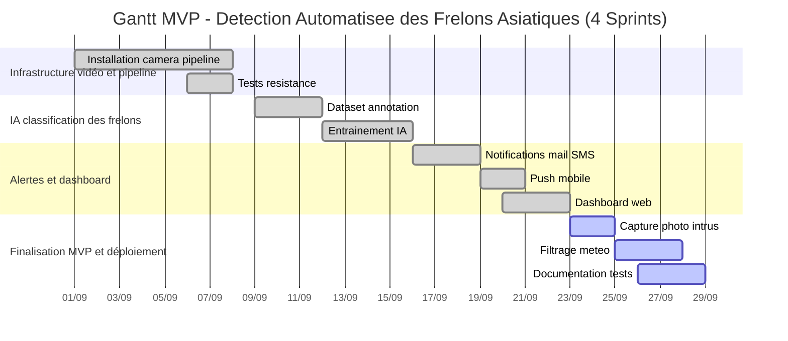
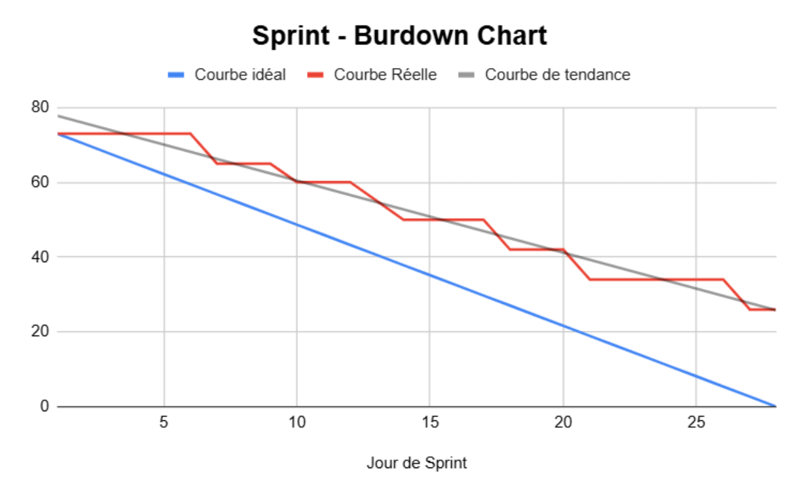

 
 
 
 
 
 
 
 
<h1 style="text-align: center;"> Scrum en Théâtre </h1> <!-- omit in toc -->
 
 
<h1 style="text-align: center;">
  <em> Quand l’Agilité Devient un Art : </em> 
  <em> Cours Méthodologique & Mise en Situation Théâtrale </em>
</h1> <!-- omit in toc -->
 
 
 
 
 

<em>Olivier BONNIN, Kahina ABBAD, Romuald COURTOIS</em>

 

<em>26/09/2025</em>

# Sommaire <!-- omit in toc -->
- [1. Contexte et Fondamentaux – Les Bases du Spectacle](#1-contexte-et-fondamentaux--les-bases-du-spectacle)
    - [Le Triangle d'Or de la Gestion de Projet](#le-triangle-dor-de-la-gestion-de-projet)
    - [Évolution des Méthodes de Gestion de Projet](#évolution-des-méthodes-de-gestion-de-projet)
- [2. Les Valeurs Fondamentales de Scrum – L'Âme de la Troupe](#2-les-valeurs-fondamentales-de-scrum--lâme-de-la-troupe)
- [3. Les Trois Piliers de Scrum – Architecture du Processus](#3-les-trois-piliers-de-scrum--architecture-du-processus)
- [4. L'Équipe Scrum – Distribution des Rôles Avant le Lever de Rideau](#4-léquipe-scrum--distribution-des-rôles-avant-le-lever-de-rideau)
  - [Le Product Owner (PO) – Le Directeur Artistique](#le-product-owner-po--le-directeur-artistique)
  - [Le Scrum Master (SM) – Le Régisseur de Production](#le-scrum-master-sm--le-régisseur-de-production)
  - [L'Équipe de Développement – La Troupe Créative](#léquipe-de-développement--la-troupe-créative)
- [5. Les Artefacts Scrum – Décors et Accessoires de la Production](#5-les-artefacts-scrum--décors-et-accessoires-de-la-production)
  - [Product Backlog – Le Script Évolutif en Perpétuelle Réécriture](#product-backlog--le-script-évolutif-en-perpétuelle-réécriture)
  - [Sprint Backlog – La Feuille de Route du Spectacle en Cours](#sprint-backlog--la-feuille-de-route-du-spectacle-en-cours)
  - [Incrément – La Performance Livrée au Public](#incrément--la-performance-livrée-au-public)
- [6. Le Cycle Scrum – Déroulement Chronologique du Projet](#6-le-cycle-scrum--déroulement-chronologique-du-projet)
  - [Le Sprint – L'Acte Théâtral Principal](#le-sprint--lacte-théâtral-principal)
  - [Sprint Planning – La Répétition Générale Avant la Représentation](#sprint-planning--la-répétition-générale-avant-la-représentation)
  - [Daily Scrum – L'Échauffement Quotidien de la Troupe](#daily-scrum--léchauffement-quotidien-de-la-troupe)
  - [Sprint Review – La Représentation Devant le Public](#sprint-review--la-représentation-devant-le-public)
  - [Sprint Retrospective – Le Débriefing Artistique de la Troupe](#sprint-retrospective--le-débriefing-artistique-de-la-troupe)
- [7. Outils et Techniques de Support – La Machinerie du Spectacle](#7-outils-et-techniques-de-support--la-machinerie-du-spectacle)
  - [Méthode Kanban – Le Tableau de Régie Visuel](#méthode-kanban--le-tableau-de-régie-visuel)
  - [Burndown Chart – Le Graphique de Performance du Sprint](#burndown-chart--le-graphique-de-performance-du-sprint)
  - [Outils Numériques de Gestion](#outils-numériques-de-gestion)
  - [Story Points et Techniques d'Estimation](#story-points-et-techniques-destimation)
- [8. Concepts Clés Complémentaires – Techniques Avancées de la Troupe](#8-concepts-clés-complémentaires--techniques-avancées-de-la-troupe)
  - [Definition of Done (DoD) – Le Standard de Qualité Absolu](#definition-of-done-dod--le-standard-de-qualité-absolu)
  - [Vélocité de l'Équipe – La Mesure de la Performance Collective](#vélocité-de-léquipe--la-mesure-de-la-performance-collective)
  - [Reste à Livrer (RAL) et Gestion des Releases](#reste-à-livrer-ral-et-gestion-des-releases)
  - [Concepts Avancés](#concepts-avancés)
- [9. Mise en Pratique Théâtrale – Ateliers et Jeux de Rôle Immersifs](#9-mise-en-pratique-théâtrale--ateliers-et-jeux-de-rôle-immersifs)
  - [Projet SCRUM - Détection d’attaques de frelons](#projet-scrum---détection-dattaques-de-frelons)
    - [9.1 Introduction](#91-introduction)
      - [Contexte du projet](#contexte-du-projet)
      - [Objectif du projet](#objectif-du-projet)
      - [Problématique à résoudre](#problématique-à-résoudre)
      - [Organisation Scrum : rôles et missions](#organisation-scrum--rôles-et-missions)
    - [9.2 Product Backlog détaillé](#92-product-backlog-détaillé)
    - [9.3 Planning Meeting](#93-planning-meeting)
      - [Objectifs du Planning Meeting](#objectifs-du-planning-meeting)
      - [Découpage en Sprints](#découpage-en-sprints)
      - [Rituels Scrum planifiés](#rituels-scrum-planifiés)
      - [Outils de suivi retenus](#outils-de-suivi-retenus)
      - [Questions clés et réponses anticipées](#questions-clés-et-réponses-anticipées)
      - [Prochaines étapes](#prochaines-étapes)
    - [9.4 Sprints Planning](#94-sprints-planning)
      - [Semaine 1 : Infrastructure vidéo et pipeline](#semaine-1--infrastructure-vidéo-et-pipeline)
      - [Semaine 2 : IA de détection et classification](#semaine-2--ia-de-détection-et-classification)
      - [Semaine 3 : Alertes et dashboard](#semaine-3--alertes-et-dashboard)
      - [Semaine 4 : Finalisation MVP et déploiement](#semaine-4--finalisation-mvp-et-déploiement)
    - [9.5 Sprint Review Hebdomadaire (Exemple pour Sprint 2 : IA de classification)](#95-sprint-review-hebdomadaire-exemple-pour-sprint-2--ia-de-classification)
    - [9.6 Sprint Review - Fin du cycle de 4 semaines](#96-sprint-review---fin-du-cycle-de-4-semaines)
    - [9.7 Sprint Retrospective - Fin du cycle de 4 semaines](#97-sprint-retrospective---fin-du-cycle-de-4-semaines)
    - [9.8 FAQ et Points sensibles à discuter](#98-faq-et-points-sensibles-à-discuter)
      - [Gestion des risques](#gestion-des-risques)
      - [Communication d’équipe](#communication-déquipe)

# 1. Contexte et Fondamentaux – Les Bases du Spectacle

### Le Triangle d'Or de la Gestion de Projet

Comme au théâtre où le metteur en scène jongle entre budget, ressources humaines et délais, la gestion de projet repose sur ce triangle d'or incontournable :

- **Budget** : les moyens financiers alloués au projet, comparable au budget de production d'un spectacle
- **Ressources** : l'équipe et les compétences disponibles, notre troupe artistique et technique
- **Délais** : les contraintes temporelles à respecter, les dates de première et de tournée

Cette triple contrainte impose des arbitrages constants, car modifier l'un des éléments impacte inévitablement les deux autres. Un bon chef de projet, comme un directeur de théâtre expérimenté, sait naviguer entre ces contraintes pour optimiser la création.

### Évolution des Méthodes de Gestion de Projet

**Méthode en Cascade (Waterfall)** : Comme une pièce classique avec ses actes séquentiels définis à l'avance, cette approche suit un déroulement linéaire rigide. Chaque étape doit être terminée avant de passer à la suivante : analyse, conception, développement, test, déploiement. Efficace pour des projets prévisibles, elle devient problématique dès que les besoins évoluent.

**Méthode en V** : Structure où chaque étape de développement correspond à une phase de test, rappelant les répétitions théâtrales où l'on travaille puis vérifie chaque scène. La validation est plus rigoureuse, mais la rigidité demeure.

**Méthode PERT** : Technique de planification par réseau, utile pour visualiser les interdépendances comme les changements de décors coordonnés. Elle excelle dans la gestion des projets complexes avec de nombreuses tâches interdépendantes.

**Méthode Agile/Scrum** : Innovation révolutionnaire comparable à l'improvisation théâtrale - adaptation constante, créativité collective, et réponse immédiate au public. Elle privilégie la collaboration, l'adaptation au changement et la livraison de valeur en continu.

---

# 2. Les Valeurs Fondamentales de Scrum – L'Âme de la Troupe

Avant de commencer tout projet Scrum, l'équipe doit s'approprier cinq valeurs fondamentales qui constituent l'âme de cette méthode, comme les émotions fondamentales qui animent tout acteur sur scène.

**1. Engagement**

Chaque membre de l'équipe s'investit personnellement dans la réussite collective, à l'image d'une troupe théâtrale unie autour d'un spectacle. Cet engagement ne se limite pas aux heures de travail, il implique une responsabilité partagée sur les objectifs et la qualité du produit final. L'engagement se manifeste par la tenue des promesses faites lors du Sprint Planning et la recherche constante de solutions face aux obstacles.

**2. Courage**

Oser prendre des décisions difficiles, exprimer ses idées même controversées et remettre en question les pratiques existantes - qualité essentielle de tout artiste. Le courage en Scrum, c'est accepter de dire "non" quand c'est nécessaire, signaler les problèmes même gênants, et proposer des changements même si cela bouscule les habitudes établies.

**3. Focus**

Se concentrer sur l'essentiel et éviter les distractions, comme un acteur qui reste dans son personnage malgré les imprévus de plateau. En Scrum, le focus signifie se concentrer sur l'objectif du Sprint en cours, éviter le multitâche excessif, et résister aux demandes urgentes qui détournent de la priorité établie.

**4. Ouverture**

Transparence et communication authentique avec l'équipe et les parties prenantes - base de toute collaboration artistique réussie. L'ouverture implique de partager ses difficultés, ses succès et ses apprentissages, créant un environnement où l'information circule librement et où les décisions peuvent être prises en connaissance de cause.

**5. Respect**

Valoriser les opinions, compétences et contributions de chacun, créant un environnement de confiance mutuelle. Le respect se traduit par l'écoute active, la reconnaissance des expertises diverses, et la construction collective des solutions plutôt que leur imposition.

# 3. Les Trois Piliers de Scrum – Architecture du Processus

Ces piliers, inspirés du contrôle empirique des processus, structurent la méthode comme les fondations d'un théâtre solide :

**1. Transparence** : Tous les aspects du processus sont visibles et compréhensibles par l'équipe, comme un plateau de théâtre éclairé pour tous. La transparence exige un langage partagé, des définitions claires, et une information accessible à tous les membres de l'équipe.

**2. Inspection** : Examen régulier du travail accompli et des artefacts produits pour détecter les écarts, comparable aux répétitions où l'on analyse chaque performance. L'inspection n'est pas un contrôle autoritaire mais une observation collective pour apprendre et s'améliorer.

**3. Adaptation** : Ajustement continu basé sur les observations et apprentissages, à l'instar des modifications apportées après chaque représentation. L'adaptation est la conséquence logique de l'inspection et doit être rapide pour être efficace.

---

# 4. L'Équipe Scrum – Distribution des Rôles Avant le Lever de Rideau

## Le Product Owner (PO) – Le Directeur Artistique

Le Product Owner incarne la vision du produit et représente la voix du client. Comme un directeur artistique porte la vision globale d'un spectacle, il définit ce qui doit être créé et pourquoi.

**Responsabilités principales :**
- **Vision produit** : Développe et communique une vision claire et inspirante du produit final
- **Gestion du Product Backlog** : Maintient une liste ordonnée et priorisée des fonctionnalités à développer
- **Interface client** : Représente les utilisateurs finaux et traduit leurs besoins en exigences techniques
- **Prise de décision** : Arbitre en cas de désaccord sur les priorités et valide les fonctionnalités livrées
- **Validation** : Accepte ou refuse les increments produits selon les critères définis

**Qualités requises :** Vision stratégique, capacité de communication, connaissance métier approfondie, autorité décisionnelle.

## Le Scrum Master (SM) – Le Régisseur de Production

Le Scrum Master assure le bon fonctionnement du processus Scrum et protège l'équipe des perturbations extérieures. Comme un régisseur coordonne tous les aspects techniques d'une production, il facilite la collaboration et résout les obstacles.

**Responsabilités principales :**
- **Facilitateur** : Organise et anime les cérémonies Scrum (réunions)
- **Protecteur de l'équipe** : Élimine les obstacles et distractions qui empêchent l'équipe de progresser
- **Garant de la méthode** : Veille au respect du cadre méthodologique et éduque l'organisation
- **Coach** : Guide l'équipe vers l'amélioration continue et l'auto-organisation
- **Servant leader** : Sert l'équipe plutôt que de la diriger, favorise l'autonomie

**Qualités requises :** Leadership serviteur, capacités de facilitation, patience, diplomatie, connaissance approfondie de Scrum.

## L'Équipe de Développement – La Troupe Créative

L'équipe de développement regroupe tous les professionnels nécessaires à la création du produit. Comme une troupe théâtrale, elle est auto-organisée et collectivement responsable du résultat.

**Caractéristiques :**
- **Auto-organisée** : Détermine comment réaliser le travail sans supervision externe
- **Pluridisciplinaire** : Possède toutes les compétences nécessaires à la création du produit
- **Taille optimale** : Entre 3 et 9 membres pour favoriser la communication directe
- **Responsabilité collective** : Engagement commun sur les objectifs du sprint, pas de spécialisation étanche
- **Amélioration continue** : Cherche constamment à optimiser ses pratiques et sa productivité

**Rôles possibles dans l'équipe :** Développeurs, testeurs, designers, architectes, analystes – tous collaborent étroitement.

---

# 5. Les Artefacts Scrum – Décors et Accessoires de la Production

## Product Backlog – Le Script Évolutif en Perpétuelle Réécriture

Le Product Backlog constitue la liste exhaustive et ordonnée de tout ce qui pourrait être nécessaire au produit. Contrairement à un cahier des charges figé, c'est un document vivant qui évolue constamment.

**Composition du Product Backlog :**

**Épopées (Epics)** : Grandes fonctionnalités complexes qui seront découpées en éléments plus petits. Exemple : "Système de paiement complet"

**User Stories** : Expression des besoins utilisateurs sous la forme "En tant que [utilisateur], je veux [fonctionnalité] afin de [bénéfice]". Exemple : "En tant que client, je veux sauvegarder mes articles dans un panier afin de finaliser mes achats plus tard"

**Fonctionnalités (Features)** : Capacités distinctes du produit ayant une valeur métier identifiable

**Tâches techniques** : Éléments nécessaires au bon fonctionnement mais invisibles pour l'utilisateur final (refactoring, mise à jour sécurité, optimisations)

**Bugs** : Corrections à apporter au produit existant

**Caractéristiques de chaque élément du Product Backlog :**
- **Description claire** : Compréhensible par tous les membres de l'équipe
- **Valeur métier identifiée** : Justification de la priorité accordée
- **Estimation** : Complexité évaluée en story points
- **Critères d'acceptation** : Conditions objectives de validation
- **Priorisation** : Ordre défini par le Product Owner selon la valeur, le risque et l'urgence

**Techniques de priorisation :**
- **MoSCoW** : Must have, Should have, Could have, Won't have
- **RICE** : Reach (portée), Impact, Confidence (confiance), Effort
- **WSJF** : Weighted Shortest Job First (tâche la plus courte pondérée en premier)

## Sprint Backlog – La Feuille de Route du Spectacle en Cours

Le Sprint Backlog représente l'engagement de l'équipe pour le Sprint en cours. Il contient les éléments du Product Backlog sélectionnés pour le Sprint, plus un plan détaillé pour les livrer.

**Composition :**
- **Objectif du Sprint** : But clair et inspirant que l'équipe s'engage à atteindre
- **User Stories sélectionnées** : Éléments du Product Backlog choisis pour le Sprint
- **Tâches détaillées** : Découpage technique des User Stories en actions concrètes
- **Estimations en heures** : Effort détaillé pour chaque tâche
- **Responsabilités** : Qui travaille sur quoi (sans affectation rigide)

Le Sprint Backlog appartient exclusivement à l'équipe de développement et peut être modifié par elle seule pendant le Sprint.

## Incrément – La Performance Livrée au Public

L'Incrément représente la somme de tous les éléments du Product Backlog terminés pendant le Sprint, plus tous les Incréments des Sprints précédents. C'est le produit tangible du travail de l'équipe.

**Caractéristiques de l'Incrément :**
- **Utilisable** : Fonctionnel et testable par les utilisateurs finaux
- **Conforme à la Definition of Done** : Respecte tous les critères de qualité définis
- **Potentiellement livrable** : Peut être mis en production immédiatement
- **Valeur ajoutée** : Apporte une amélioration mesurable au produit
- **Transparent** : Démontrable lors de la Sprint Review

---

# 6. Le Cycle Scrum – Déroulement Chronologique du Projet

## Le Sprint – L'Acte Théâtral Principal

Le Sprint constitue le cœur battant de Scrum. C'est une période de travail de durée fixe (1 à 4 semaines) pendant laquelle l'équipe crée un Incrément de produit utilisable.

**Caractéristiques du Sprint :**
- **Durée fixe** : Identique tout au long du projet pour créer un rythme régulier
- **Objectif clair** : But précis et mesurable défini en début de Sprint
- **Périmètre protégé** : Pas de changements majeurs pendant le Sprint
- **Livraison garantie** : Incrément potentiellement livrable à la fin
- **Amélioration continue** : Chaque Sprint est une occasion d'apprendre et de s'améliorer

Le Sprint contient tous les autres événements Scrum et constitue le conteneur de toutes les activités de développement.

---

## Sprint Planning – La Répétition Générale Avant la Représentation

Le Sprint Planning lance officiellement chaque Sprint. C'est une réunion collaborative où l'équipe planifie le travail à accomplir pendant le Sprint.

**Déroulement du Sprint Planning :**

**Première partie – "Quoi ?" (50% du temps)**
- Le Product Owner présente l'objectif du Sprint proposé
- L'équipe examine les éléments du Product Backlog les plus prioritaires
- Discussion collaborative sur les fonctionnalités à inclure
- Clarification des exigences et des critères d'acceptation
- Sélection finale des User Stories pour le Sprint

**Deuxième partie – "Comment ?" (50% du temps)**
- L'équipe de développement décompose les User Stories en tâches
- Estimation détaillée du travail nécessaire
- Identification des dépendances et des risques
- Validation de la faisabilité dans le temps imparti
- Engagement final de l'équipe sur l'objectif du Sprint

**Participants :** Toute l'équipe Scrum (Product Owner, Scrum Master, équipe de développement)
**Durée :** Maximum 2 heures par semaine de Sprint (8h pour un Sprint de 4 semaines)

**Techniques utilisées :**

**Planning Poker :** Technique d'estimation collaborative utilisant des cartes avec la suite de Fibonacci (1, 2, 3, 5, 8, 13, 21, 34, 55, 89). Chaque membre estime simultanément, puis l'équipe discute des écarts pour converger vers un consensus.

**Vélocité :** Mesure de la capacité de l'équipe basée sur la moyenne des story points réalisés lors des sprints précédents. Permet de prévoir raisonnablement le volume de travail possible.

**Story Points :** Unité de mesure relative de la complexité, basée sur l'effort, la complexité et le risque. Permet de comparer les tâches entre elles sans dépendre des particularités individuelles.

---

## Daily Scrum – L'Échauffement Quotidien de la Troupe

Le Daily Scrum est une réunion quotidienne de synchronisation qui permet à l'équipe de développement de planifier le travail des prochaines 24 heures.

**Format et règles :**
- **Durée** : Exactement 15 minutes, pas plus
- **Horaire** : Même heure chaque jour pour créer une routine
- **Lieu** : Même endroit si possible, debout pour maintenir l'énergie
- **Participants** : Équipe de développement obligatoire, autres rôles en observateurs

**Les trois questions fondamentales :**
1. **"Qu'ai-je accompli hier qui a aidé l'équipe à atteindre l'objectif du Sprint ?"**
2. **"Que vais-je faire aujourd'hui pour aider l'équipe à atteindre l'objectif du Sprint ?"**
3. **"Quels obstacles rencontré-je ou vais-je rencontrer qui pourraient empêcher l'équipe d'atteindre l'objectif du Sprint ?"**

**Objectifs du Daily Scrum :**
- Synchroniser l'équipe sur l'avancement
- Identifier rapidement les obstacles
- Adapter le plan si nécessaire
- Maintenir la communication quotidienne
- Renforcer l'engagement collectif

Le Daily Scrum n'est pas un rapport au management mais un outil d'auto-organisation de l'équipe. Les discussions détaillées sont reportées après la réunion.

---

## Sprint Review – La Représentation Devant le Public

La Sprint Review clôture le Sprint par une démonstration du travail accompli aux parties prenantes. C'est un moment de célébration, d'inspection et d'adaptation.

**Déroulement de la Sprint Review :**
- **Présentation de l'objectif du Sprint** : Rappel de ce qui était planifié
- **Démonstration de l'Incrément** : Présentation concrète des fonctionnalités réalisées
- **Discussion ouverte** : Questions, remarques et suggestions des participants
- **Feedback collectif** : Recueil des réactions et besoins émergents
- **Adaptation du Product Backlog** : Mise à jour des priorités selon les retours

**Participants :** Équipe Scrum complète + parties prenantes (utilisateurs, clients, management, autres équipes concernées)
**Durée :** 1 heure par semaine de Sprint (4h maximum pour un Sprint de 4 semaines)

**Objectifs :**
- Créer la transparence sur l'avancement réel
- Recueillir des retours utilisateurs précoces
- Adapter le produit aux besoins émergents
- Célébrer les réussites de l'équipe
- Maintenir l'engagement des parties prenantes

La Sprint Review est informelle, centrée sur la démonstration plutôt que sur les présentations PowerPoint. L'accent est mis sur la collaboration et l'inspection du produit réel.

---

## Sprint Retrospective – Le Débriefing Artistique de la Troupe

La Sprint Retrospective conclut le Sprint par une réflexion collective sur le processus de travail. C'est le moment privilégié de l'amélioration continue.

**Déroulement de la Retrospective :**

**Phase 1 – Préparation (Set the stage)**
- Rappel de l'objectif et des règles de bienveillance
- Tour de table sur le ressenti général du Sprint

**Phase 2 – Collecte des données (Gather data)**
- Recueil factuel des événements marquants du Sprint
- Identification des points positifs et des difficultés rencontrées

**Phase 3 – Génération d'idées (Generate insights)**
- Analyse collective des causes profondes
- Recherche de patterns et de corrélations

**Phase 4 – Décision d'actions (Decide what to do)**
- Sélection de 1 à 3 actions d'amélioration concrètes
- Définition des responsabilités et échéances

**Phase 5 – Clôture (Close the retrospective)**
- Validation des engagements pris
- Feedback sur la retrospective elle-même

**Participants :** Équipe de développement, Scrum Master, Product Owner
**Durée :** 45 minutes par semaine de Sprint (3h maximum pour un Sprint de 4 semaines)

**Questions centrales :**
- **"Qu'est-ce qui a bien fonctionné pendant ce Sprint ?"**
- **"Qu'est-ce qui pourrait être amélioré ?"**
- **"Quelles actions concrètes allons-nous mettre en place ?"**

**Techniques d'animation :**
- Mad, Sad, Glad (énervé, triste, content)
- Starfish (Start, Stop, Continue, More, Less)
- 4Ls (Liked, Learned, Lacked, Longed for)
- Timeline collaborative
- Vote à points pour prioriser les actions

---

# 7. Outils et Techniques de Support – La Machinerie du Spectacle

## Méthode Kanban – Le Tableau de Régie Visuel

Le tableau Kanban visualise le flux de travail et permet à l'équipe de suivre l'avancement en temps réel. Comme un tableau de régie théâtrale, il offre une vue d'ensemble instantanée.

**Colonnes classiques :**
- **À faire (To Do)** : Tâches sélectionnées mais pas encore commencées
- **En cours (Doing/In Progress)** : Travail actuellement en développement
- **En test (Testing/Review)** : Éléments en cours de validation
- **Terminé (Done)** : Travail complètement fini selon la Definition of Done

**Règles d'utilisation :**
- Une carte = une tâche ou user story
- Limite du travail en cours (WIP limits) pour éviter la dispersion
- Mise à jour quotidienne par l'équipe
- Discussions lors du Daily Scrum

**Bénéfices :**
- Transparence immédiate sur l'avancement
- Identification rapide des blocages
- Limitation du multitâche excessif
- Motivation par la progression visible

## Burndown Chart – Le Graphique de Performance du Sprint

Le Burndown Chart visualise la progression du Sprint en montrant l'évolution du travail restant jour après jour.

**Construction du graphique :**
- **Axe X** : Jours du Sprint (de 1 à la durée du Sprint)
- **Axe Y** : Points d'effort restants (story points ou heures)
- **Courbe idéale** : Ligne droite décroissante du total initial à zéro
- **Courbe réelle** : Progression effective de l'équipe

**Interprétation :**
- Courbe réelle au-dessus de l'idéale : retard potentiel
- Courbe réelle en dessous de l'idéale : avance sur la planification
- Plateau horizontal : pas de progression, blocage possible
- Chute brutale : tâches terminées en lot

**Variantes :**
- **Burnup Chart** : Montre le travail accompli (progression positive)
- **Release Burndown** : Vision sur plusieurs Sprints pour une release

## Outils Numériques de Gestion

**Trello :** Interface simple type Kanban, idéale pour débuter
- Cartes colorées et personnalisables
- Collaboration en temps réel
- Intégrations multiples
- Gratuit pour les petites équipes

**JIRA :** Solution complète pour équipes techniques avancées
- Gestion complète des projets Agile
- Rapports automatisés (burndown, vélocité)
- Workflows personnalisables
- Intégration avec outils de développement

**Azure DevOps :** Plateforme Microsoft complète
- Intégration native avec Visual Studio
- Gestion du code source incluse
- Pipelines CI/CD intégrés
- Reporting avancé

**Asana :** Gestion collaborative polyvalente
- Interface intuitive
- Gestion des dépendances
- Vue timeline et calendrier
- Collaboration étendue

## Story Points et Techniques d'Estimation

**Story Points - Principe :**
Les Story Points mesurent la complexité relative des tâches plutôt que le temps absolu. Cette approche élimine les biais individuels et se concentre sur la comparaison entre éléments.

**Suite de Fibonacci en Story Points :**
1, 2, 3, 5, 8, 13, 21, 34, 55, 89...
Cette progression non-linéaire reflète l'incertitude croissante pour les tâches complexes.

**Critères d'estimation :**
- **Effort** : Quantité de travail nécessaire
- **Complexité** : Difficulté technique et fonctionnelle  
- **Risque** : Incertitudes et obstacles potentiels
- **Connaissance** : Familiarité de l'équipe avec le domaine

**Planning Poker - Processus détaillé :**

1. **Présentation** : Le Product Owner explique la User Story
2. **Questions** : L'équipe clarifie les ambiguïtés
3. **Estimation silencieuse** : Chaque membre choisit une carte secrètement
4. **Révélation simultanée** : Toutes les cartes sont dévoilées en même temps
5. **Discussion** : Focus sur les estimations extrêmes (plus haute et plus basse)
6. **Nouvelle estimation** : Répétition jusqu'au consensus
7. **Décision finale** : Validation collective de l'estimation

**Avantages du Planning Poker :**
- Évite l'influence des opinions dominantes
- Encourage la discussion et le partage de connaissance
- Améliore la compréhension collective des tâches
- Crée l'engagement de l'équipe sur les estimations

---

# 8. Concepts Clés Complémentaires – Techniques Avancées de la Troupe

## Definition of Done (DoD) – Le Standard de Qualité Absolu

La Definition of Done établit la liste exhaustive des critères que doit respecter chaque élément pour être considéré comme terminé. C'est le contrat qualité de l'équipe.

**Critères typiques d'une DoD :**

**Technique :**
- Code écrit et commenté selon les standards
- Tests unitaires écrits et passants (couverture > 80%)
- Code reviewé par au moins un pair
- Intégration réussie dans la branche principale
- Aucun bug bloquant ou critique

**Fonctionnel :**
- Tous les critères d'acceptation validés
- Tests fonctionnels passants
- Validation par le Product Owner
- Documentation utilisateur mise à jour
- Accessibilité vérifiée selon les standards

**Processus :**
- Déployé en environnement de test
- Tests de performance réalisés si pertinents
- Sécurité vérifiée selon les exigences
- Sauvegarde des données de configuration
- Formation des utilisateurs effectuée si nécessaire

**Évolution de la DoD :**
La Definition of Done évolue avec la maturité de l'équipe et du produit. Elle devient progressivement plus exigeante, intégrant de nouveaux critères qualité.

## Vélocité de l'Équipe – La Mesure de la Performance Collective

La vélocité mesure la capacité de travail de l'équipe sur plusieurs Sprints. C'est un indicateur de prévisibilité et d'amélioration continue.

**Calcul de la vélocité :**
Vélocité = Moyenne des story points "Done" sur les 3-5 derniers Sprints

**Utilisation de la vélocité :**
- **Planification** : Estimer la quantité de travail possible dans un Sprint
- **Prévision** : Calculer combien de Sprints nécessaires pour une release
- **Amélioration** : Identifier les tendances d'amélioration ou de dégradation
- **Communication** : Expliquer la capacité de l'équipe aux parties prenantes

**Facteurs influençant la vélocité :**
- Stabilité de l'équipe (arrivées/départs)
- Complexité du domaine métier
- Qualité de la Definition of Done
- Obstacles et interruptions externes
- Amélioration des compétences et outils

**Erreurs à éviter :**
- Comparer les vélocités entre équipes différentes
- Utiliser la vélocité comme indicateur de performance individuelle
- Pression pour augmenter artificiellement la vélocité
- Modifier l'estimation des tâches pour "améliorer" la vélocité

## Reste à Livrer (RAL) et Gestion des Releases

**Calcul du RAL :**
RAL = (Story points restants dans le Product Backlog) / (Vélocité moyenne)

Cette formule donne une estimation du nombre de Sprints nécessaires pour terminer le périmètre actuel.

**Gestion des Releases :**
Une Release regroupe plusieurs Sprints pour livrer un ensemble cohérent de fonctionnalités aux utilisateurs finaux.

**Release Planning :**
- Définition des objectifs métier de la Release
- Sélection des fonctionnalités prioritaires
- Estimation globale et planification temporelle
- Identification des dépendances et risques
- Communication vers les parties prenantes

**Release Burndown :**
Graphique montrant l'avancement sur plusieurs Sprints vers l'objectif de Release.

## Concepts Avancés

**Technical Debt (Dette technique) :**
Travail technique reporté qui ralentit le développement futur. Doit être géré explicitement dans le Product Backlog.

**Spike :** 
Investigation limitée dans le temps pour réduire l'incertitude technique ou fonctionnelle. Produit de la connaissance plutôt qu'un incrément utilisable.

**Hardening Sprint :**
Sprint dédié à la stabilisation et à la préparation du déploiement. À éviter si possible grâce à une bonne Definition of Done.

---

# 9. Mise en Pratique Théâtrale – Ateliers et Jeux de Rôle Immersifs

---

## Projet SCRUM - Détection d’attaques de frelons  

### 9.1 Introduction

#### Contexte du projet

L’apiculture est menacée par deux prédateurs : le frelon asiatique (Vespa velutina) et le frelon européen (Vespa crabro). Le frelon asiatique est particulièrement destructeur : il attaque les abeilles devant la ruche, les décapite et rapporte les morceaux dans son nid, affaiblissant rapidement la colonie.

L’objectif de ce projet est de développer un système intelligent de surveillance basé sur caméras, capteurs et IA pour détecter automatiquement les attaques, alerter les apiculteurs et fournir des statistiques fiables sur les menaces.

#### Objectif du projet

- Détecter automatiquement les frelons (asiatiques et européens).
- Identifier et tracer la trajectoire de fuite (ruche → nid).
- Capturer une photo du frelon pour confirmer l’espèce.
- Réduire les faux positifs dus à la météo ou aux nuages d’abeilles.
- Fournir un tableau de bord quotidien avec statistiques et alertes.

#### Problématique à résoudre

- Comment assurer une détection fiable malgré vent, pluie ou mouvements massifs d’abeilles ?
- Comment distinguer frelon asiatique et frelon européen ?
- Comment tracer la trajectoire vers le nid (et détecter plusieurs nids) ?
- Comment fournir à l’apiculteur des alertes simples et des statistiques utiles ?

#### Organisation Scrum : rôles et missions  

- **Product Owner (PO) : Olivier**  
  Responsable de la vision produit et de la priorisation du backlog. Il s’assure que les besoins métier sont bien compris et traduits en User Stories claires, valide les livrables à chaque sprint et pilote la relation avec les parties prenantes.

- **Scrum Master : Romuald**  
  Facilitateur du processus Scrum, il organise les rituels, aide l’équipe à lever les obstacles, veille au respect des bonnes pratiques Scrum et à l’amélioration continue du fonctionnement de l’équipe.

- **Équipe de développement : Kahina (et autres membres)**  
  Responsable de la réalisation technique, elle conçoit, développe, teste et intègre les fonctionnalités. L’équipe est auto-organisée et collabore étroitement avec le PO pour livrer les User Stories définies dans le sprint.

### 9.2 Product Backlog détaillé 

| Priorité | User Story | Critères d’acceptation clés | Definition of Done | Story Points | Timebox estimé |
|----------|------------|--------------|-----------------------------|--------------------|------------|
| 1        | US1 - Identification Frelon (Asiatique/Européen) | - Précision ≥85% sur jeu test                                 | - Modèle intégré dans pipeline et fonctionnel                    | 8            | 7 à 10 jours          |
|          |                                            | - Classification fiable des 2 types                          | - Validation PO réalisée                                         |              |                       |
|          |                                            |                                                              | - Code review effectué, tests automatisés réussis                |              |                       |
| 1        | US2 - Dashboard Statistiques Quotidiennes  | - Dashboard web responsive avec stats temps réel             | - Données actualisées en temps réel                              | 5            | 4 à 6 jours           |
|          |                                            | - Affichage nombre d’attaques, types frelons, heures         | - Tests fonctionnels complets                                    |              |                       |
|          |                                            |                                                              | - Documentation utilisateur mise à jour                          |              |                       |
| 1        | US3 - Alerte Immédiate (Mail/SMS)           | - Notifications envoyées < 5 min après détection             | - Notifications testées sur au moins 2 canaux                   | 5            | 4 à 6 jours           |
|          |                                            |   - Notifications push fonctionnelles sur Android et iOS      | - Tests de latence validés                                       |              |                       |
| 1        |                                              |          - Latence et fiabilité testées                                                  | - Tests sur émulateurs ou appareils réels                       | 5            | 4 à 6 jours           |
|          |                                            |                                                                    | - Documentation mise à jour                                      |              |                       |
| 1        | US4 - Capture Photo Intrus                   | - Photo prise dans les 2 sec après détection                  | - Qualité photo validée par l’équipe                             | 8            | 7 à 10 jours          |
|          |                                            | - Résolution suffisante pour identification humaine          | - Intégration fonctionnelle dans pipeline                        |              |                       |
| 2        | US5 - Filtrage météo (éviter faux positifs) | - Réduction d’au moins 50% des faux positifs météo           | - Tests en conditions réelles et simulées                        | 8            | 7 à 10 jours          |
|          |                                            |                                                              | - Algorithme validé et intégré                                   |              |                       |
| 2        | US6 - Gestion nuage d’abeilles / multiples ruches | - Distinction fiable entre nuage d’abeilles et attaque frelon | - Validation terrain ou simulation                               | 8            | 7 à 10 jours          |
|          |                                            | - Indication de présence de plusieurs ruches                 | - Documentation associée                                         |              |                       |
| 3        | US7 - Triangulation position du Nid          | - Estimation du nid à < 50m de précision sur tests terrain   | - Algorithme de triangulation intégré et testé                  | 13           | 10 à 15 jours         |
|          |                                            |                                                              | - Plans d’atténuation documentés                                |              |                       |
| 3        | US8 - Détection de plusieurs Nids             | - Détection d’au moins 2 nids distincts >80% précision       | - Tests validés en scénario multi-nids                          | 13           | 10 à 15 jours         |
|          |                                            |                                                              | - Rapports et documentation complète                             |              |                       |

Chaque User Story doit être affinée et détaillée dans Trello ou l’outil de gestion choisi, avec checklist, pièces jointes, commentaires et responsabilités assignées.  

---

### 9.3 Planning Meeting  

*Début du Planning Meeting*

**Date : 01/09/2025**  
**Participants : Olivier (PO), Romuald (Scrum Master), Kahina (Développeur)**

---

#### Objectifs du Planning Meeting  
- Valider la vision globale du projet et ses objectifs métiers.  
- Découper le projet en Sprints clairs avec des objectifs précis.  
- Sélectionner les User Stories prioritaires pour chaque sprint.  
- Estimer la charge et définir la velocity prévisionnelle.  
- Organiser les rituels Scrum et outils de suivi.  

---

#### Découpage en Sprints  

| Semaine   | Objectif Sprint                      | Stories sélectionnées          | Definition of Done / Critères clés                  |
|-----------|------------------------------------|-------------------------------|-----------------------------------------------------|
| Semaine 1 | Infrastructure vidéo et pipeline   | US1                           | Caméra robuste, flux vidéo stable, tests météo validés |
| Semaine 2 | IA classification des frelons      | US2                           | Modèle IA précision >85%, intégré et testé          |
| Semaine 3 | Alertes et dashboard               | US3, US4                      | Notifications fonctionnelles, dashboard accessible  |
| Semaine 4 | Finalisation MVP et déploiement   | US5, US6                      | Photo intrus, tests 72h, documentation livrée       |

---

#### Rituels Scrum planifiés  
- **Sprint Planning :** lundi 9h-10h  
- **Daily Scrum :** 15 minutes chaque jour à 9h30  
- **Sprint Review :** dernier jour du sprint 4 avec toute l'équipe et le client 
- **Sprint Retrospective :** après la Sprint Review avec toute l'équipe --> Retex

#### Outils de suivi retenus  
- **Trello:** gestion des User Stories et tâches  
- **Burndown Chart:** suivi de la progression du sprint  
- **Velocity:** mesure de la performance sprint à sprint  

#### Questions clés et réponses anticipées  
- *Disponibilité des experts entomologistes pour annotation ?* Planification en avance et sessions coordonnées.  
- *Risques liés aux conditions météo ?* Tests en simulation et tests en conditions réelles seront effectués.  
- *Priorisation des fonctionnalités secondaires ?* Elles seront intégrées dans les sprints ultérieurs après validation du MVP.  

#### Prochaines étapes  
- Finaliser le backlog produit détaillé.  
- Préparer le Sprint Planning 1.  
- Valider les ressources et outils nécessaires.  

**Conclusion :**  
Ce Planning Meeting a permis d’aligner toute l’équipe et les parties prenantes sur la vision, les priorités et le découpage en sprints. Il instaure un cadre clair et collaboratif qui facilitera la livraison incrémentale de valeur métier tout au long du projet.  

*Fin du Planning Meeting*

---

### 9.4 Sprints Planning  

#### Semaine 1 : Infrastructure vidéo et pipeline  

**Sprint Goal :**  
Installer un système de capture vidéo robuste et stable en toutes conditions météo avec un flux vidéo prêt pour traitement temps réel.  

**User Stories sélectionnées :**  
- US1 - Identification Frelon (Asiatique/Européen) [Préparation initiale d’infrastructure]  

**Tâches principales :**  
- Sélection et achat caméra IP66/67 résistante aux intempéries  
- Conception et installation du boîtier étanche avec chauffage anti-condensation  
- Mise en place du pipeline de streaming vidéo stable  
- Réalisation de tests de résistance aux intempéries (simulation pluie, neige)  

**Definition of Done :**  
- Caméra fonctionnelle 24h/24 en conditions réelles  
- Flux vidéo stable et continu  
- Tests météo validés avec rapport d’évaluation  

---

#### Semaine 2 : IA de détection et classification  

**Sprint Goal :**  
Constituer un dataset annoté et entraîner un modèle IA capable de différencier frelons asiatiques, européens, abeilles, bourdons, et guêpes avec précision ≥85%.  

**User Stories sélectionnées :**  
- US1 - Identification Frelon (suite)  
- US2 - Dashboard statistiques quotidiennes (préparation des données)  

**Tâches principales :**  
- Collecte et annotation d’images auprès des experts entomologistes  
- Entraînement du modèle CNN multi-classes (type YOLO)  
- Validation sur jeu de test, optimisation pour inférence temps réel  

**Definition of Done :**  
- Dataset complet et validé  
- Modèle entraîné avec précision testée  
- Modèle intégré dans pipeline, tests d’inférence réussis  

---

#### Semaine 3 : Alertes et dashboard  

**Sprint Goal :**  
Développer le système de notifications (mail, SMS, push) et un dashboard web responsive pour le suivi des attaques.  

**User Stories sélectionnées :**  
- US2 - Dashboard statistiques (finalisation)  
- US3 - Alerte immédiate (Mail/SMS)   

**Tâches principales :**  
- Développement API notifications multi-canal  
- Conception et réalisation du dashboard web  
- Intégration du système d’alertes au pipeline de détection  
- Tests et validation des fonctionnalités  

**Definition of Done :**  
- Notifications testées et fonctionnelles  
- Dashboard accessible et affichant les données en temps réel  
- Données historiques sauvegardées et exploitables  

---

#### Semaine 4 : Finalisation MVP et déploiement  

**Sprint Goal :**  
Livrer un MVP complet, testé en conditions réelles, avec documentation et interface d’administration.  

**User Stories sélectionnées :**  
- US4 - Capture photo haute résolution des intrus  
- US5 - Filtrage météo faux positifs  
- Documentation utilisateur et technique  
- Tests d’endurance système (72h continu)  

**Tâches principales :**  
- Développement module capture photo  
- Optimisation consommation énergétique  
- Rédaction documentation complète  
- Organisation tests d’acceptation client et déploiement  

**Definition of Done :**  
- MVP validé par le client  
- Documentation livrée  
- Système opérationnel en production  

---

### 9.5 Sprint Review Hebdomadaire (Exemple pour Sprint 2 : IA de classification)

---

### 9.6 Sprint Review - Fin du cycle de 4 semaines  

**Déroulement :**  
La Sprint Review s’est tenue le 26/09/2025, en présence du Product Owner, du Scrum Master, et de toute l’équipe de développement et le client.  

**Livrables présentés :**  
- Le système complet de capture vidéo a été déployé en conditions réelles et a fonctionné de manière stable malgré diverses conditions météo.  
- Le modèle IA intégré a détecté et différencié les frelons asiatiques et européens, abeilles, bourdons et guêpes avec une précision de 88% validée.  
- Le système d’alertes multi-canal (mail, SMS, notifications push) a bien fonctionné avec un délai moyen d’envoi de moins de 3 minutes.  
- Le dashboard web a permis un suivi en temps réel des attaques quotidiennes avec des graphiques d’activité clairs.  
- Le module capture photo des intrus a capturé des images exploitables immédiatement.  
- Les tests d’endurance 72h ont confirmé la stabilité et l’optimisation énergétique.  
- La documentation utilisateur et technique a été présentée et validée.  

**Retour du Product Owner :**  
- Le PO a souligné la qualité du travail et la conformité avec le cahier des charges.  
- Des suggestions ont été émises pour prioriser les traitements de triangulation des nids et améliorer encore l’ergonomie mobile du dashboard.  

   

**Décisions prises :**  
- Ajout au backlog des User Stories secondaires pour la triangulation et détection multi-nids.  
- Organisation d’une formation utilisateur prévue dans le prochain sprint.  
- Proposition d’un suivi post-déploiement pour ajuster la précision du modèle selon données réelles.  

**Conclusion :**  
Cette Sprint Review finale a validé la réussite de la phase MVP, confirmé la satisfaction du Product Owner, et orienté les travaux futurs vers des fonctionnalités avancées, assurant une évolution agile centrée sur l’exploitation réelle et la valeur apportée aux utilisateurs.  

---

### 9.7 Sprint Retrospective - Fin du cycle de 4 semaines  

**Déroulement :**  
La rétrospective a eu lieu juste après la Sprint Review, avec participation complète de l’équipe Scrum.  

**Points positifs :**  
- Excellente collaboration entre les membres, particulièrement lors du sprint IA, grâce à des échanges réguliers avec les experts entomologistes.  
- Respect global des délais malgré certaines difficultés techniques.  
- Mise en place efficace des outils de suivi (Trello, Gantt, burndown chart) facilitant la transparence.  

**Difficultés rencontrées :**  
- Le délai pour constituer un dataset de qualité a été plus long que prévu, impactant le planning initial.  
- Les premiers tests météo réels étaient limités en raison de conditions climatiques peu favorables.  
- Certaines alertes présentaient des faux positifs, nécessitant un filtrage supplémentaire.  

**Actions d’amélioration décidées :**  
- Programmer dès le début du projet les sessions d’annotation avec les experts pour garantir leur disponibilité.  
- Développer en parallèle des tests en laboratoire pour simuler météo variée.  
- Intégrer un module de filtrage météo dans les sprints suivants pour améliorer la fiabilité des alertes.  

**Engagements pour la suite :**  
- Mieux planifier la charge de travail des experts externes.  
- Consolider l’automatisation des tests pour accélérer les retours qualité.  
- Renforcer la communication quotidienne pour anticiper rapidement les blocages.  

--- 

### 9.8 FAQ et Points sensibles à discuter  

#### Gestion des risques  
- **Q : Comment anticiper les retards dus à l’indisponibilité des experts ?**  
  R : Planification avancée des sessions d’annotation et recours à des ressources de soutien si besoin.  

- **Q : Que faire en cas de conditions météo limitant les tests terrain ?**  
  R : Mise en place de tests en laboratoire ou en simulation pour garantir la continuité.  

- **Q : Comment limiter l’impact des faux positifs sur la crédibilité du système ?**  
  R : Intégration d’un filtrage adapté et validation continue avec retours terrain.  

#### Communication d’équipe  
- **Q : Comment éviter les blocages entre équipes spite à des incompréhensions ?**  
  R : Daily Scrums efficaces, transparence totale via Trello, transmission claire des informations critiques.  

- **Q : Quel est le rôle du Scrum Master dans la résolution des conflits ou obstacles ?**  
  R : Facilitateur, il identifie les freins rapidement, organise des échanges ciblés et veille au maintien d’un climat collaboratif.  

- **Q : Comment maintenir la motivation et l’engagement sur un projet long ?**  
  R : Objectifs clairs, reconnaissance des succès à chaque sprint, implication des membres dans les décisions.

---

**Références et Approfondissements :**
- Manifeste Agile (2001) : principes fondamentaux
- Scrum Guide officiel (Schwaber & Sutherland) : référence méthodologique
- "Scrum: The Art of Doing Twice the Work in Half the Time" - Jeff Sutherland
- Certification Scrum Master Professional pour approfondir la pratique